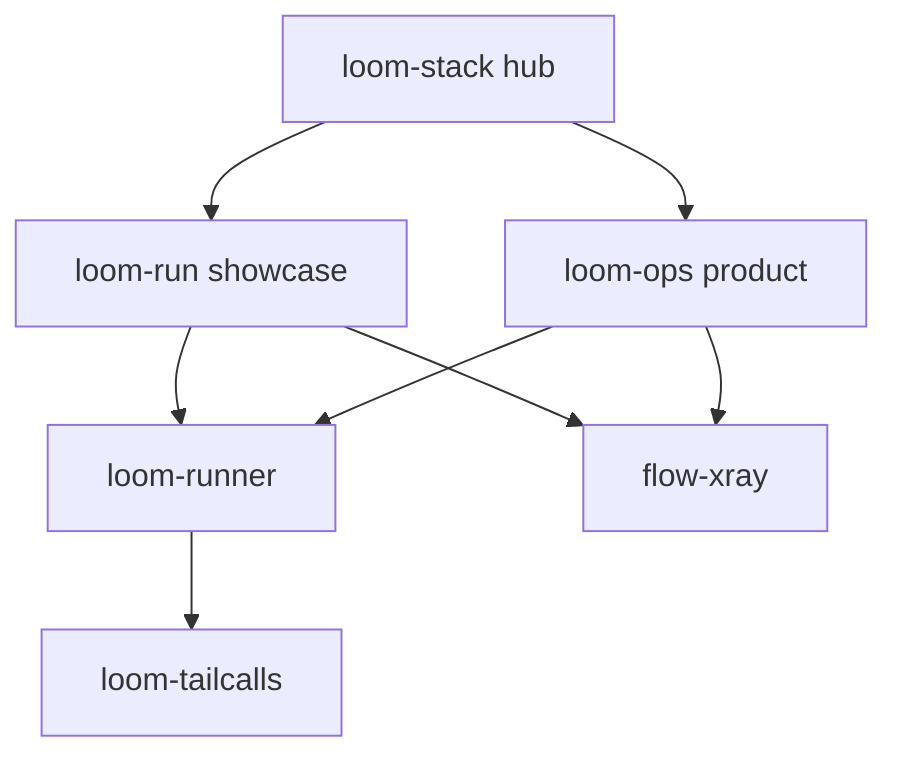

# Loom stack — how loom-ops fits

[loom-ops](https://github.com/kroq86/loom-ops) is the **ops/runbook** product in the [Loom stack](https://kroq86.github.io/loom-stack/). It shares runtime and tracing with the showcase agent, but targets incident/deploy procedures—not dev chat.

## Stack map

| Repo | Role | Use when |
|------|------|----------|
| [**loom-stack** (hub)](https://kroq86.github.io/loom-stack/) | Docs, install order, comparisons | Onboarding; which repo to clone |
| [**loom-runner**](https://github.com/kroq86/loom-runner) | Durable runtime: SQLite checkpoints, `resume`, `explain` | You need execution semantics (used by both agents) |
| [**loom-run**](https://github.com/kroq86/loom-run) | Showcase: dev repo agent (`chat`, read/search/tests) | Local dev assistant on a codebase |
| [**loom-ops**](https://github.com/kroq86/loom-ops) (this repo) | Product: runbook supervisor (planner / executor / verifier) | Incident/deploy runbooks, HITL, audit |
| [**flow-xray**](https://github.com/kroq86/flow-xray) | Offline HTML execution traces | Postmortem after `loom-ops … --trace trace.html` |
| [**loom-tailcalls**](https://github.com/kroq86/loom-tailcalls) | Tail-call scheduling for long agent loops | Pulled in via `loom-runner` (no direct import here) |



## What loom-ops imports (technical wiring)

| Dependency | How loom-ops uses it |
|------------|----------------------|
| `loom-runner` | `AgentRunner`, `SQLiteCheckpointStore`, `RunContext.call_tool` — all runs checkpointed |
| `flow-xray` | `loom-ops supervise|runbook --trace trace.html` via `flow_xray.trace` |
| `loom-tailcalls` | Transitive through `loom-runner` for step driving |

CLI entrypoint: **`loom-ops`** (not `loom-runner`). Low-level runner CLI remains in the `loom-runner` package for library users.

## Choose the right agent

| Need | Repo |
|------|------|
| “Read my repo, run tests, fix code” | [loom-run](https://github.com/kroq86/loom-run) |
| “Follow our incident runbook with approve + audit” | **loom-ops** (here) |
| “Embed durable steps in my own app” | [loom-runner](https://github.com/kroq86/loom-runner) |
| “Show me what the agent actually did” | [flow-xray](https://github.com/kroq86/flow-xray) |

## Cross-install (try the stack locally)

```bash
# Hub docs: https://kroq86.github.io/loom-stack/

# Ops product (this repo)
pip install "loom-ops[api]"
# or from source:
git clone https://github.com/kroq86/loom-ops.git && cd loom-ops
pip install -e ".[dev,api]"

# Dev showcase (sibling)
git clone https://github.com/kroq86/loom-run.git && cd loom-run
pip install -e ".[dev,api]"
```

Same runtime (`loom-runner`), different tools and CLIs.

## Trace workflow (loom-ops + flow-xray)

```bash
loom-ops supervise "incident: API latency spike" \
  --run-id inc-001 --db ops.sqlite --mock-llm --workspace . \
  --trace postmortem.html
# open postmortem.html — flow-xray execution graph
```

Checkpoint detail still comes from `loom-ops explain --run-id …` (loom-runner store).

## Sibling repos should link back

For a consistent stack story, these pages should mention **loom-ops**:

- [loom-stack hub](https://kroq86.github.io/loom-stack/) — product row + “ops vs dev” table
- [loom-run README](https://github.com/kroq86/loom-run) — “for runbooks see loom-ops”
- [loom-runner README](https://github.com/kroq86/loom-runner) — consumers: loom-run, loom-ops

Changes in those repos are separate PRs; this file is the **canonical ops-side** stack description.
